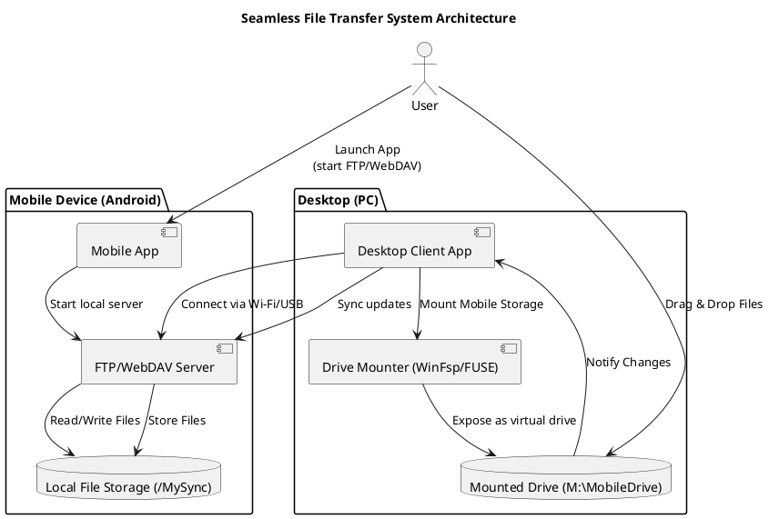

# MobiLinkDrive

---

## 📄 **Project Proposal: Seamless File Transfer System Between Mobile and Computer**

### **1. Project Title**

**Seamless Mobile-PC File Transfer and Sync System**

---

### **2. Objective**

To develop a seamless file sharing and synchronization system that allows users to transfer files between their Android mobile devices and personal computers (Windows/Linux/macOS) as easily as using a USB drive or cloud storage, without relying on third-party cloud services.

---

### **3. Problem Statement**

Existing solutions like Google Drive, Dropbox, or USB connections either depend on internet connectivity or require manual connection steps. Users often struggle with:

* Tedious file sharing between mobile and computer
* Limited or no internet for cloud-based storage
* Lack of instant access to mobile storage from PC

---

### **4. Proposed Solution**

Develop a system where the mobile device appears as a **virtual drive on the computer**, allowing drag-and-drop access, automatic synchronization, and file transfer over **local Wi-Fi** or **USB tethering** without using cloud services.

---

### **5. Key Features**

* 📁 Mobile file system mounted as a virtual drive on PC (`M:\MobileDrive`)
* 🔄 Two-way file sync (push/pull files)
* 🔐 Secure local connection (optional HTTPS/WebDAV)
* 🌐 Optional cloud sync extension (future scope)

---

### **6. System Components**

#### A. Mobile App (Android)

* FTP/WebDAV server service
* File access and permission handling
* Selective sync folder (e.g., `/MySync`)

#### B. Desktop Client

* Detects mobile over LAN or USB
* Mounts the mobile sync folder as a virtual drive using WinFSP (Windows) or FUSE (Linux/macOS)
* Drag-and-drop UI and file sync monitoring

#### C. Communication Layer

* File transfer over FTP/WebDAV/REST
* Secure local network connection
* USB tethering fallback option

---

### **7. Technology Stack**

| Component       | Technology                            |
| --------------- | ------------------------------------- |
| Mobile App      | Kotlin / Flutter + Android SDK        |
| Desktop Client  | Python / Node.js + Electron / Tkinter |
| Mounting Drive  | WinFSP (Windows), FUSE (Linux/macOS)  |
| Protocol        | FTP / WebDAV / REST API over HTTP(S)  |
| File Sync Logic | Watchdog / Inotify / Custom Logic     |

---

### **8. System Architecture Diagram (PlantUML Code)**

You can render this using [PlantUML online](https://www.plantuml.com/plantuml/) or in an IDE like IntelliJ with the PlantUML plugin.

---

### **9. Future Enhancements**

* Cloud backup integration (e.g., to S3, Firebase)
* Cross-device sync (tablet, secondary phones)
* Background auto-sync with scheduling
* End-to-end encryption
* iOS support

---

### **10. Conclusion**

This project provides a practical, efficient, and private alternative to traditional file sharing methods. By integrating local network technologies with intuitive drive mounting, it mimics cloud drive behavior while staying entirely within the user’s ecosystem. It has strong real-world application potential and can serve as a foundation for further innovations in peer-to-peer file syncing.
